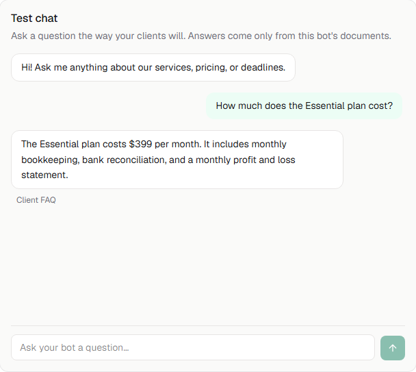
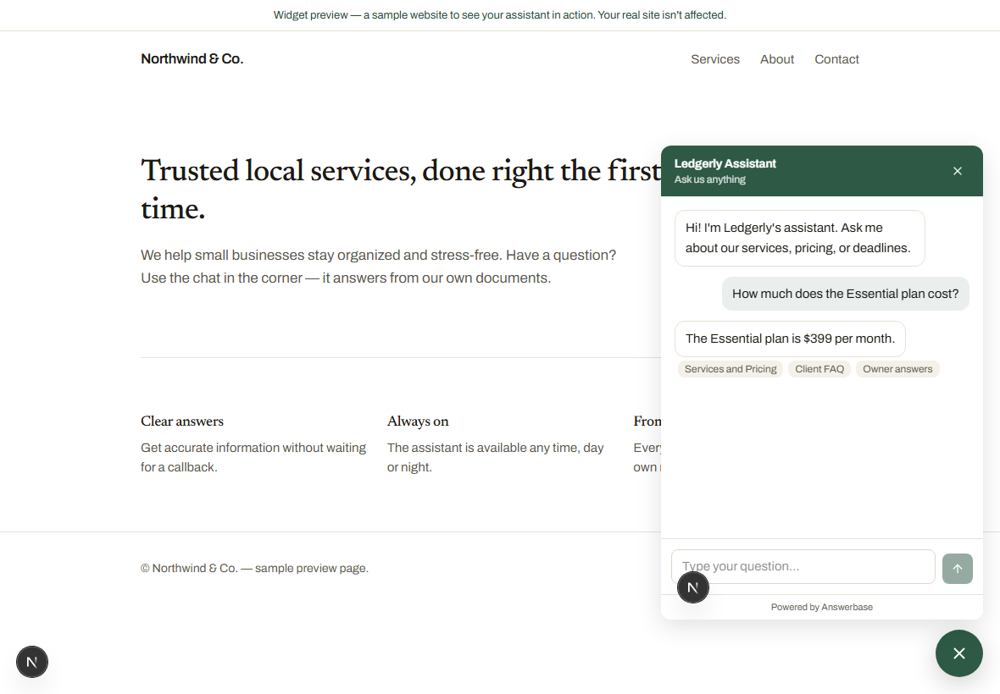

# Answerbase

Turn the documents a business already has into a client-facing AI assistant —
a chat inside the app and an embeddable widget for the company's website.

**Live demo:** https://answerbase-rho.vercel.app
**Demo login:** `demo@answerbase.app` / `Demo-Answerbase-2026` (test data only)



---

## What it does

- **Create a bot** and upload your documents (PDF, Markdown, or text). They're
  parsed, chunked, and embedded automatically, with a visible status per file.
- **Chat grounded in your docs.** Answers cite the source document they came
  from. When the answer isn't in your documents, the bot says so honestly
  instead of guessing.
- **Embed a widget** on any website with one line of code — a launcher bubble
  and an in-iframe chat in your accent color.
- **Close knowledge gaps.** Every question the bot couldn't answer is logged.
  Answer it once and it joins the bot's knowledge instantly.
- **Plans & limits.** Free and Pro tiers with server-side limits and usage
  meters. Billing is mocked (the assignment allows it) — no card is charged.



## Stack

- **App:** Next.js 16 (App Router) · TypeScript (strict) · Tailwind 4 ·
  shadcn/ui (restyled to the design tokens)
- **Data / Auth / Storage / Vectors:** Supabase (Postgres + pgvector + Auth +
  Storage)
- **LLM:** DeepSeek V4 Flash via OpenRouter, streamed with the Vercel AI SDK
  (the chat model is configurable via `OPENROUTER_CHAT_MODEL`)
- **Embeddings:** `google/gemini-embedding-2` (1536-dim) via OpenRouter,
  isolated behind `lib/embeddings.ts`
- **Hosting:** Vercel

There is no queue: document processing runs inside route handlers
(`maxDuration = 60`) with status persisted in the DB and polled by the client —
right-sized for demo-scale documents.

## How the RAG pipeline works

1. Embed the question and run a cosine similarity search (`match_chunks` RPC)
   over the bot's chunks.
2. Build context from the top matches and stream an answer with a system prompt
   that allows **only** the provided context — no outside knowledge.
3. If the answer isn't in the context, the model returns a fixed honest
   fallback, which is detected and logged as a knowledge gap.
4. Sources shown to the user are derived from the retrieved chunks' documents,
   not from the model's text, so citations are always truthful.

See [docs/ARCHITECTURE.md](docs/ARCHITECTURE.md) for the full design.

## Local setup

Prerequisites: Node 20.9+ (built on Node 24), a Supabase project, and an
OpenRouter API key.

```bash
git clone https://github.com/nickopengroup/answerbase.git
cd answerbase
npm install
```

1. **Supabase.** Create a project. In the SQL Editor, run the migrations in
   order:
   - `supabase/migrations/0001_init.sql`
   - `supabase/migrations/0002_workspace_on_signup.sql`

   Then turn **off** email confirmation (Authentication → Sign In / Providers →
   Email → "Confirm email") so sign-up logs in immediately. For production,
   leave it on.

2. **Environment.** Copy the example and fill it in:

   ```bash
   cp .env.example .env.local
   ```

   | Variable | Where to find it |
   |---|---|
   | `NEXT_PUBLIC_SUPABASE_URL` | Supabase → Settings → API (Project URL) |
   | `NEXT_PUBLIC_SUPABASE_ANON_KEY` | Supabase → Settings → API (anon key) |
   | `SUPABASE_SERVICE_ROLE_KEY` | Supabase → Settings → API (service_role key) |
   | `OPENROUTER_API_KEY` | https://openrouter.ai → Keys (covers chat + embeddings) |
   | `NEXT_PUBLIC_APP_URL` | `http://localhost:3000` locally; your domain in prod |

3. **Run it.**

   ```bash
   npm run dev
   ```

4. **(Optional) Load the demo.** Seeds the Ledgerly Bookkeeping bot with six
   documents and example knowledge gaps:

   ```bash
   npm run seed
   ```

5. **(Optional) Run the golden set** against the seeded bot:

   ```bash
   npm run golden   # writes docs/GOLDEN_SET_RESULTS.md
   ```

## Project structure

```
app/
  (marketing)/      landing page
  (auth)/           sign in / sign up
  (app)/            dashboard, bots, billing, settings (authed)
  w/[token]/        widget chat page (rendered inside the iframe)
  api/              chat, documents, widget endpoints
lib/                embeddings, rag, chat, chunking, parsing, limits, supabase clients
public/embed.js     the one-line embed script
supabase/migrations/
scripts/            seed, golden set, and per-phase verification scripts
docs/               product spec, architecture, design, plan, content, golden results
```

## How this was built with Claude Code

This repo was built end to end with Claude Code, working **phase by phase
against a locked set of specs** rather than free-styling:

- [docs/PRODUCT_SPEC.md](docs/PRODUCT_SPEC.md) fixes the scope,
  [docs/ARCHITECTURE.md](docs/ARCHITECTURE.md) the technical decisions,
  [docs/DESIGN.md](docs/DESIGN.md) the visual system and an anti-slop checklist,
  and [docs/PLAN.md](docs/PLAN.md) the phase order with acceptance criteria.
  [CLAUDE.md](CLAUDE.md) holds the working protocol the agent followed.
- **Every phase was verified with evidence, not vibes.** Each
  `scripts/verify-phase*.ts` proves that phase's acceptance criteria against the
  real database — e.g. RLS isolation between two users, the document pipeline
  reaching `ready` with real embeddings, the refusal gate skipping the LLM, and
  the gap loop making a question answerable.
- **Decisions were made against reality.** Billing is mocked because the
  assignment permits it; workspaces are created in-app rather than via a trigger
  on `auth.users` (which Supabase restricts); and the similarity threshold was
  calibrated from the golden set (see
  [docs/GOLDEN_SET_RESULTS.md](docs/GOLDEN_SET_RESULTS.md)), which showed the
  real refusal work is done by the prompt, not a magic number.
- Product screenshots on the landing page are captured from the running
  production build with Playwright (`scripts/landing-shots.ts`) — they're the
  real UI, not mockups.

## Notes

- Billing is simulated — upgrading/downgrading flips the plan directly; limits
  and gating are enforced for real.
- Out of scope by design: multi-language, team members, analytics dashboards,
  third-party integrations, and end-user chat history.
